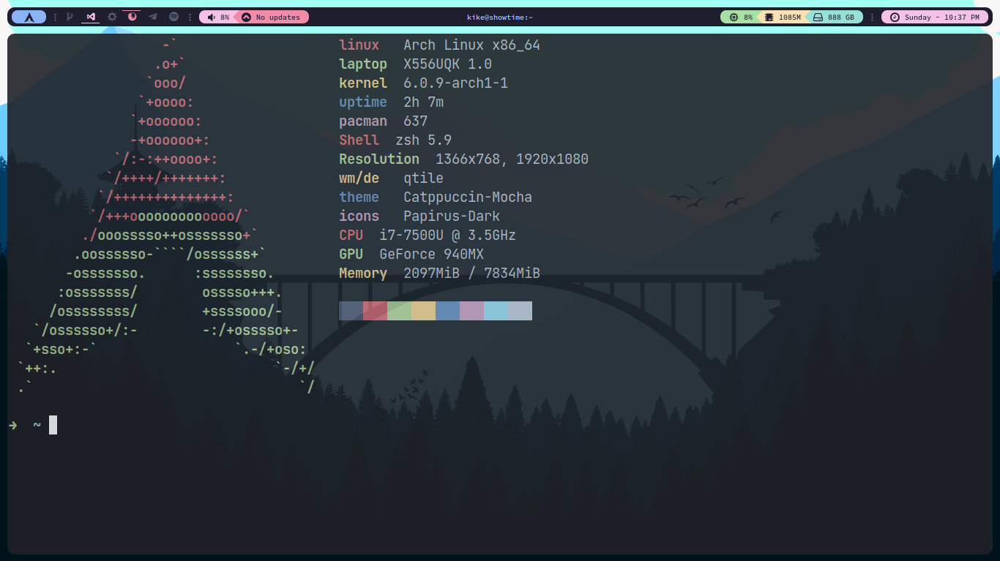

<h1 id="top" align="center"> Machfiles 🐶 </h1>



<p align="center">Credits to <a href="https://github.com/jx11r/qtile">@jx11r</a></p>

## Installation

1. Download `git` and GNU `stow`.

2. Clone into your `$HOME` directory or `~`.

   ```bash
   git clone https://github.com/enrique-mendoza/Machfiles.git ~
   ```

3. Run `stow` to symlink everything or just select what you want:

   ```bash
   stow */ # Everything (the '/' ignores the README)
   ```

   ```bash
   stow zsh # Just zsh config
   ```
